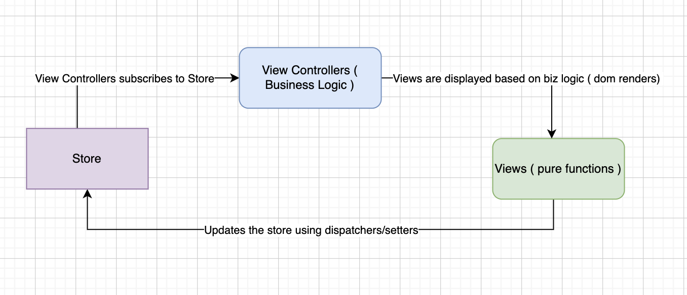

Design discussion:
- The client side is inspired by Flux design pattern
  - I dont use Mvc as it has proven to be non-scalable as it works with data(model) being modified by both the controller and the views, so side effects are possible.
- All the components are pure functions.
- The components are data driven and follows single responsibility principle.
- The single point of truth for the data is store.js.
- Whenever store changes, all the subscribers to the store are notified with new store value.
  - Implements the observer design pattern.

Key points:
- Functional programming
- Single responsibility principle.
- Observer design pattern.

